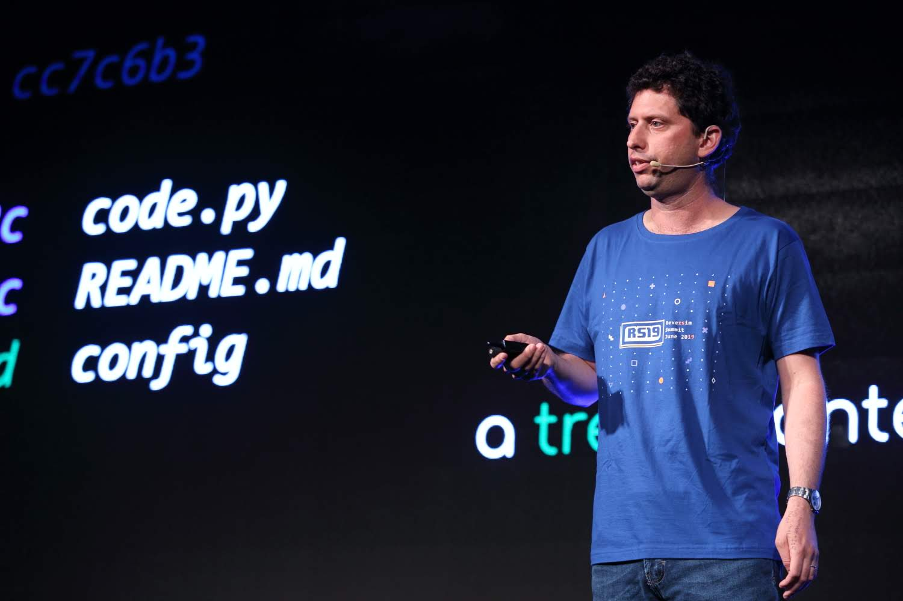
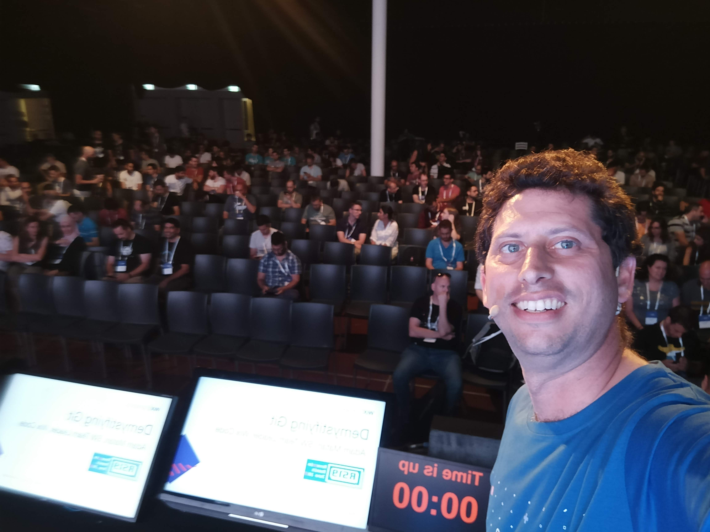

# Public Speaking Experience

Image credit - Gidi Fisher, [Artcore media](www.artcore.media)

## 2019

* [Reversim Summit 2019](https://summit2019.reversim.com/), 2019-06-17, [Demystifying git: from SHA to interactive rebase](https://summit2019.reversim.com/session/5c75adf7e037850017ca38cd.html) ([Slides](https://drive.google.com/open?id=143w10UlY0Byd_I4GPEWInPHpyKlq2drMx1ExinIXZc0), [Video](https://youtu.be/FlpXes7QVk4)), Hebrew
* [Practical git for devs](https://www.facebook.com/1839082432986850/posts/2436625203232567), 2019-05-15, at [Outbrain.com](outbarin.com) with a workshop, [Youtube Video (English)](https://youtu.be/j_tP0K_nZcQ)
* [FITC Web Unleashed 2019](https://fitc.ca/presentation/building-a-serverless-production-ready-web-app-in-45-minutes/), 2019-09-13, [Building a Serverless, Production-Ready Web App in 45 Minutes](https://www.youtube.com/watch?v=zlccgcKzQkI&list=PLCN6Xts5ioBWNGx3bAGPv7LL3qgD6REKe&index=9&t=274s)

## 2018

* [Reversim Summit 2019](https://summit2019.reversim.com/), 2019-06-17, [Demystifying git: from SHA to interactive rebase](https://summit2019.reversim.com/session/5c75adf7e037850017ca38cd.html) ([Slides](https://drive.google.com/open?id=143w10UlY0Byd_I4GPEWInPHpyKlq2drMx1ExinIXZc0), [Video](https://youtu.be/FlpXes7QVk4))
* [Serverless Days Milano](https://milan.serverlessdays.io/), 2018-10-19, [Think Functions](https://youtu.be/hB8Mpew44wk)
* [Serverless TLV Meetup](https://www.meetup.com/ServerlessTLV/events/sjcrdqyxmbhb/), 2018-09-04, [Think Functions](https://www.youtube.com/watch?v=Xr9fa_CtLL8) (Hebrew)
* [Serverlessconf San Francisco](https://sf.serverlessconf.io/home.html), 2018-07-31, [Think Functions](https://acloud.guru/series/serverlessconf-sf-2018/view/944a6499-5dc0-ac52-8cae-7dafced1a286), With Avner Braverman
* [Reversim Podcast](http://www.reversim.com/), 2018-04-24, [Episode 340: Serverless with Adam Matan](http://www.reversim.com/2018/04/340-serverless-with-adam-matan.html), Audio, Hebrew
* [Serverlessconf Paris](http://paris.serverlessconf.io/), 2018-02-15, [Sub second CI CD pipeline with FaaS](https://www.youtube.com/watch?v=iG4WIEixTf4), With Avner Braverman

# CFPs

* [Google Sheets as a backend: Generating static websites with dynamic content](cfps/google-sheets-as-a-backend.md)
* [A practical workshop for building a Serverless app backed by Redis](cfps/redis-serverless-workshop.md)
* [Think Functions](cfps/think-functions.md)
* [Think Functions (Short version)](cfps/think-functions-short-kubecon.md)
* [Content curation](cfps/content-curation.md)

# Communities

* Founded [Serverless Days TLV](https://tlv.serverlessdays.io/), Israel's first Serverless conference with ~250 attendees
* Co-Founded [Serverless Nights TLV](https://www.meetup.com/ServerlessTLV), Israel's leading Serverless meetup group
* Volunteer at [Reversim Summit](https://summit2018.reversim.com/), Israel's largest open-source and startup conference. Head of conference ([2016](https://summit2016.reversim.com/)), Head of content ([2017](https://summit2017.reversim.com/)), Track moderator ([2018](https://summit2018.reversim.com/))

# Bio
R&D manager at [Wix](http://wix.com/), building a serverless platform for rapid web apps development. Ex Dev/DevRel at [Reshuffle](https://reshuffle.com/), [Waze](https://en.wikipedia.org/wiki/Waze), [Yahoo](https://techcrunch.com/2010/10/05/yahoo-dapper/) and [Vioozer](https://www.crunchbase.com/organization/viooz). I have been building backend apps for the last decade. Public speaker, [Serverless Days TLV](https://tlv.serverlessdays.io/) founder, [Serverless Nights TLV](https://www.meetup.com/ServerlessTLV) co-founder. Linux and Bitcoin fan. Based in Tel Aviv. My public key is [`F83B4D4DB6C43726`](https://keybase.io/adamatan).

