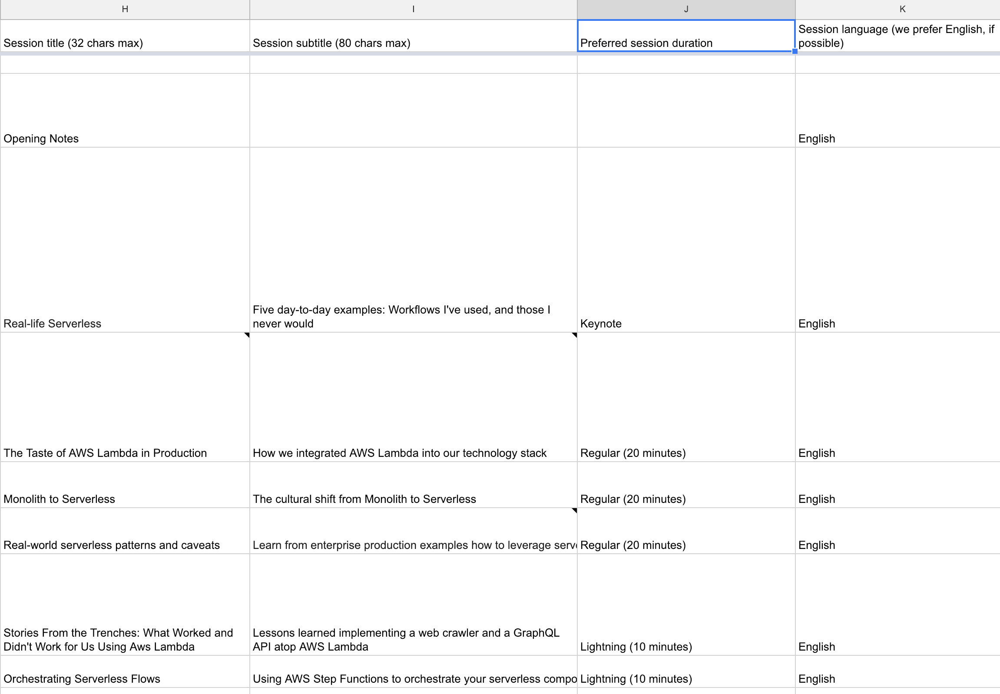

# Title
Google Sheets as a backend: Generating static websites with dynamic content

# Elevator Pitch (300 characters)
Static websites hosted on services like S3 scale well, but non-devs have trouble maintaining them. Content Management Systems like WordPress are accessible for non-devs, but scale poorly, and require constant maintenance. How can we use Serverless wisdom help static engines host dynamic content?

# Talk Format
Lighting (20 minutes)
---

# Description
In early 2018 I had to built a conference site for a Serverless Days event. There were multiple stakeholders - speakers, event managers and my own team - who needed access to the content, from changing one's bio to drafting the agenda.

Using a [CMS](https://en.wikipedia.org/wiki/Content_management_system) like [WordPress](https://en.wikipedia.org/wiki/WordPress) was out of the question. Speakers share their session links on their personal profiles, so the conference site to be available for years. Wordpress requires maintenance, configurations, updates and security patches, which no one wants to handle. Beyond that, one does not bring servers to a Serverless party.

The surprising solution was using Google Sheets as my backend. User authentication and authorization is given out of the box, and a simple build process converted the well-structured sheets into CSVs and Python objects. A Jinja engine used this data inside a template and published it online.

# Topics covered
* Reviewing the problem: Dynamic content on a static site
* Security and maintainability considerations
* Resemblance to APIs: combining static and dynamic content
* Using Google Sheets as a Backend
* Build tools: Jinja, S3, Cloudfront, Lambda, [discourse](https://www.discourse.org/)
* Lessons learned

# Images

## Google Sheets Agenda

## Agenda Webpage

---

# Notes for the reviewers
* A user story in which Serverless tools and principles (never pay for idle, worry-free scaling and service mesh) helped me solve a common problem
* Introductory-level session that almost every developer can relate to
* Google Sheets is not a classic Serverless example. Explaining this choice helps me discuss Serverless principles, not just products
* Can be delivered as a lightning or a full talk