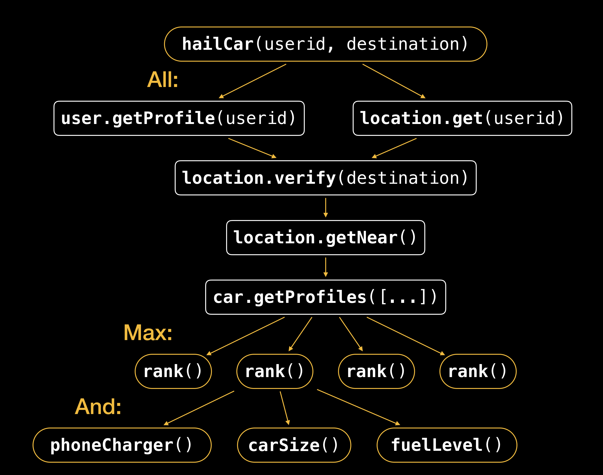
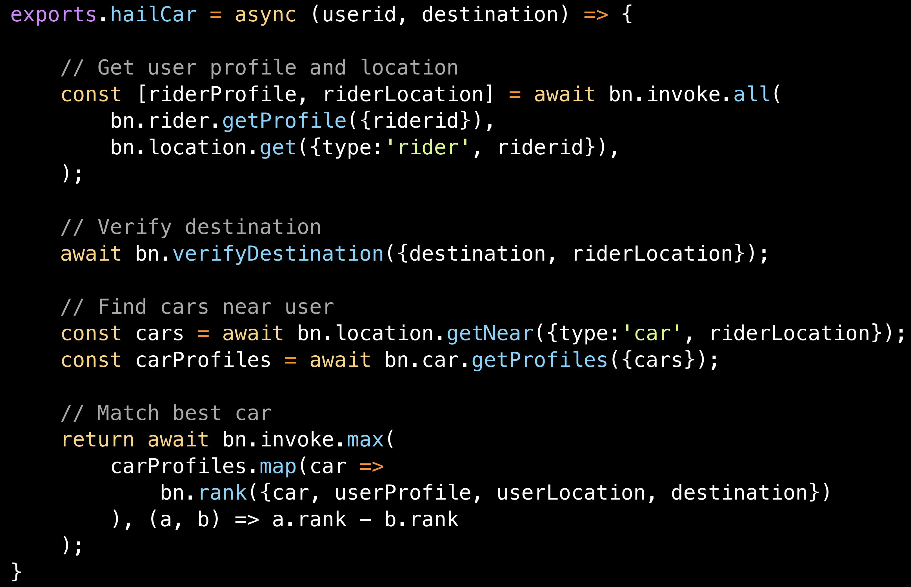

# Title
Thinks Functions

# Elevator Pitch (300 characters)
What would apps look like if we never had to think about servers, performance or even cost? This session demonstrates how an Uber-like ridesharing application can be built entirely from functions -  starting with an architectural overview and progressing to actual JS code.

# Talk Format
40 minutes
---

# Description
This session demonstrates how a real-time app can be built solely out of functions while remaining responsive and cost-effective. We present an architecture overview of the app and walk through the process of splitting it into individual services.

Now, *code*! We write an entire service - the ridesharing service, responsible for hailing a car in real time - in functions, and describe how we can express concurrent invocations of such functions - ranging from simple parallel execution to applying numerical and logical operators on cloud functions.

To conclude, we will analyze cost and performance considerations and the limitations of current platforms.

# Is it practical?
_Yes_. While not each and every operator presented on stage is available on all FaaS platforms, most of them can be applied using third-party libraries.

# Is it technical?
_Yes_. While we do discuss performance and cost, most of the session is code-centric, discussing the implications of concurrent invocations to remote functions.

# Topics covered
* Taxi app for driverless cars: Why do we choose Virtual Machines and Containers?
* Advantages of building an app from functions
* Architectural review and services
* Code!

---

# Notes for the reviewers
I delivered this session (along with co-speaker) in Serverless conference 2018 SF and received positive feedback. The session is intended for a technical audience, as does include considerable amounts of code.

# Is it vendor-specific?
_Just a little_. Some of the advantages we present are unique to a single platform, but most of the patterns are available on most platforms directly or via third-party libraries.
